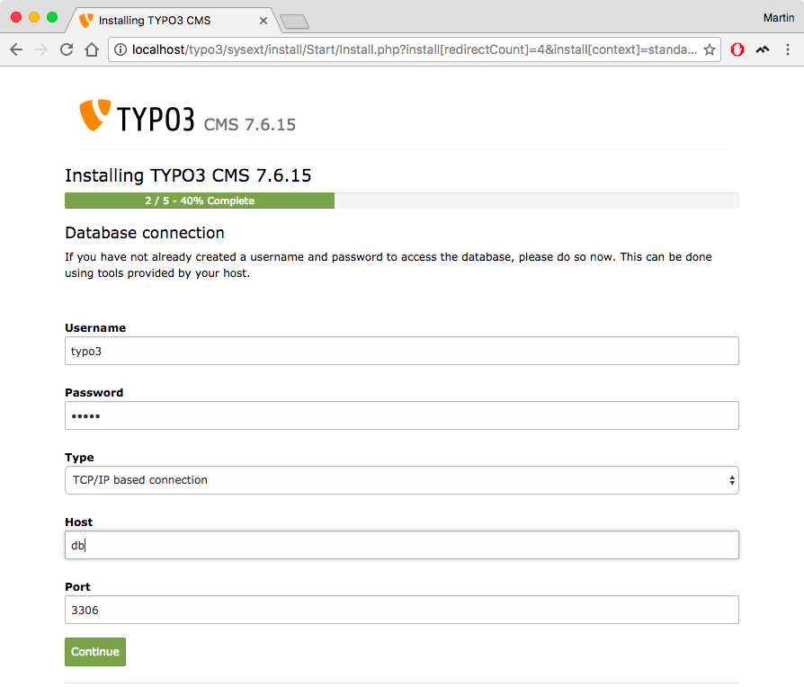

TYPO3 Quickstart in Docker
==========================

This repository contains build instructions for a simple TYPO3 Docker image.

**Note** that this image is not intended for production usage (yet). It's goal is to provide users an easy quickstart for working with TYPO3.

Usage
-----

This container does not ship a database management system; which means you'll have to create your own database container. The upside of this is that you're not bound to any specific version of MySQL or MariaDB and can even use a PostgreSQL database if you like.

1. So, the first step should be to create a database container:

        $ docker run -d --name typo3-db \
           -e MYSQL_ROOT_PASSWORD=yoursupersecretpassword \
           -e MYSQL_USER=typo3 \
           -e MYSQL_PASSWORD=yourothersupersecretpassword \
           -e MYSQL_DATABASE=typo3 \
           mariadb:latest \
           --character-set-server=utf8 \
           --collation-server=utf8_unicode_ci
2. Create the image or use the repository image

        $ docker build -t=martinhelmich/typo3:8.7 .

3. Next, use this image to create your TYPO3 container and link it with the database container:

        $ docker run -d --name typo3-web \
            --link typo3-db:db \
            -p 80:80 \
            martinhelmich/typo3:7

 ALternative you can also use docker-compose.

4. After that, simply open `http://localhost/` in your browser to start the TYPO3 install tool. **Note**: If you're using Docker Machine to run Docker on Windows or MacOS, you'll need the Docker VM's IP instead (which you can find out using the `docker-machine ip default` command).

5. Complete the install tool. When prompted for database credentials, use the environment variables that you've passed to the database container in step 1. If you've linked the containers using the `--link` flag as shown in step 2, use `db` as database host name.

 

Available tags
--------------

This repository offers the following image tags:

- `latest` maps to the latest available version
- `8.0` and `8` for the latest available version from the `8.*` respectively `8.0.*` branch.
- `7.6` and `7` for the latest available version from the `7.*` respectively `7.6.*` branch.
- `6.2` and `6` for the latest available version from the `6.*` respectively `6.2.*` branch.
